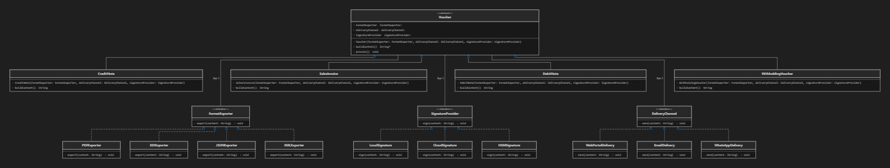

# Bridge Pattern Exercise

## Analysis Question Answer

**Question:** What new class should be created to add the EDI format, what should it inherit from or implement, and why doesn't this require changing the Voucher class or its subclasses?

**Answer:** 
To add the EDI format, we just need to create a new class called EDIExporter that implements the FormatExporter interface. 

We don't need to change Voucher or its subclasses because the Bridge pattern separates the main concept (Voucher) from its specific formats (FormatExporter). The Voucher class only talks to the interface, so it doesn't care what the specific formats are. This makes it easy to add new formats later without breaking or changing the old code (this is known as the Open/Closed Principle).

